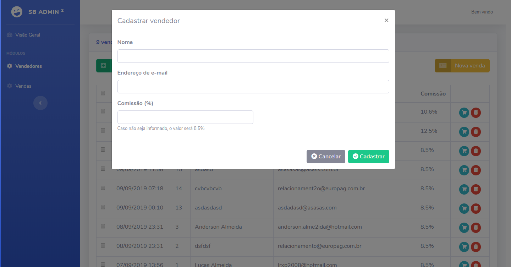
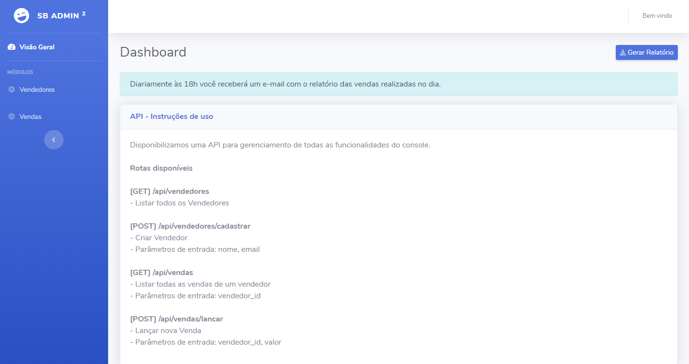
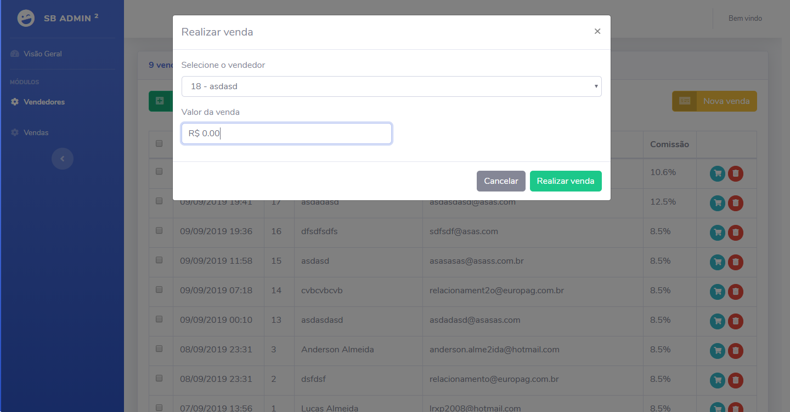
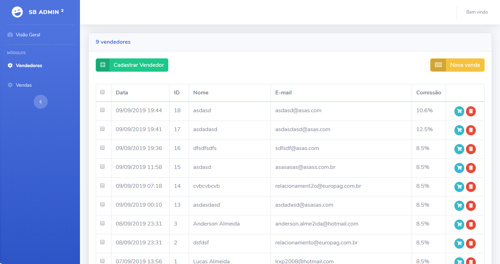

# Laravel APP - Vendedores

Essa APP foi desenvolvida utilizando o Framework Laravel. Seu propósito é para cadastro de vendedores e vendas, com cálculo de comissões e disparo de relatório no final do dia - É necessário utilizar o Laravel API - Vendedores.  
  
## Visão geral

Painel de controle para cadastro de vendedores e cálculo de comissão.

### Pré-requisitos

Caso você não utilize o Homestead, é necessário os seguintes requisitos para utilização dessa API:

- PHP >= 7.2.0
- BCMath PHP Extension
- Ctype PHP Extension
- JSON PHP Extension
- Mbstring PHP Extension
- OpenSSL PHP Extension
- PDO PHP Extension
- Tokenizer PHP Extension
- XML PHP Extension

```
É altamente recomendado a utilização do Homestead para uso local.
```

### Configurando permissões de diretório

Após clonar esse projeto, você precisará configurar algumas permissões. Diretórios como o "storage" e "bootstrap/cache" precisam de permissão de escrita (755) ou o Laravel não irá funcionar. Caso você esteja utilizando o Homestead, essas permissões são configuradas automaticamente.

```
chmod -R 755 storage
chmod -R 755 bootstrap/cache
```

### Configurando a Application Key

Se você instalou o Laravel utilizando o Composer ou a instalação do Laravel, a chave foi configurada automaticamente. Se precisar gerar uma nova chave, utilize o seguinte comando:

```
php artisan key:generate

Se você não configurar a Application Key, sessão e outros dados de usuários não estarão seguros!
```
### Configurando o Endpoint da API

Acesse o arquivo *.ENV localizado na raíz do projeto, e altere a senha linha:

```
API_URL=http://tray_api.test <---- Sua URL da API
```

## Configurações adicionais

Após configurar o arquivo .ENV, é necessário executar os seguintes comandos:

```
php artisan cache:clear
php artisan migrate
```

## Deploy

Para utilização do Homestead, utilize:

```
vagrant up
```

## Autores

Lucas Ronaldo de Almeida  
  
## Screenshots  
  





## License

This project is licensed under the MIT License - see the [LICENSE.md](LICENSE.md) file for details
